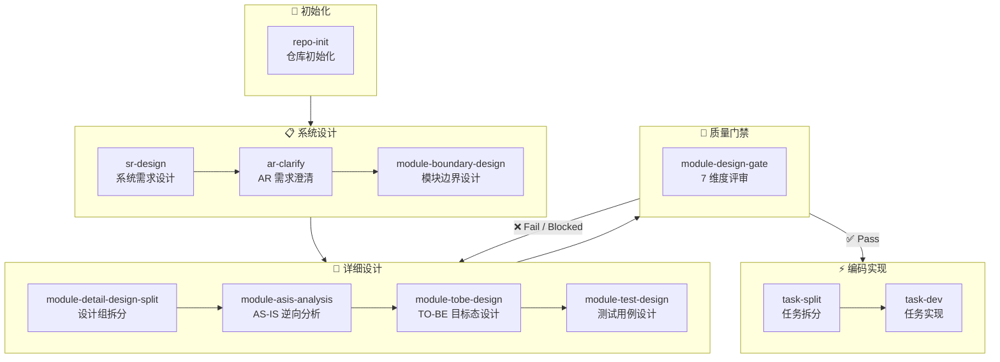

# Awesome-Agent-Workflow (AAW)

**AAW** 是一套**基于 AI Agent 的软件研发工作流体系**，将 AI 编码助手的能力通过 10 个严格阶段化技能串联成一条可追溯、可审查、可落地的完整研发管道——从需求设计到任务拆分再到代码实现，每一个决策都有据可查，每一个变更都有章可循。

## 核心理念

| 理念 | 说明 |
|------|------|
| **规格驱动开发 (SDD)** | 先设计后编码，所有实现都追溯到设计文档 |
| **证据链闭环** | 需求 → AS-IS 代码证据 → TO-BE 设计决策→ 测试用例，环环相扣 |
| **关注点分离** | AS-IS 分析、TO-BE 设计、测试设计、质量把关各自独立，互不越界 |
| **对抗式审查** | 边界设计和质量门禁阶段通过子 Agent 以「假设文档有错」的视角进行对抗性审查 |
| **单一任务锁** | 任务实现严格按序执行，禁止跨任务工作 |

## 工作流总览



### 10 阶段说明

| 阶段 | 技能 | 职责 | 输出物 |
|------|------|------|--------|
| 初始化 | `repo-init` | 创建 `.sdd/` 目录结构，生成架构模板、编码规范、AGENTS.md | 仓库初始化完成 |
| 1 | `sr-design` | 通过决策树式问答引导用户完成系统需求设计 | `SR-design.md` |
| 2 | `ar-clarify` | 从 SR 提取单个 AR 的需求范围，结合代码实际做差距分析 | `AR-clarify.md` |
| 3 | `module-boundary-design` | 识别受影响模块，定义模块边界、职责、交互序列，对抗审查 | 模块边界设计文档 |
| 4 | `module-detail-design-split` | 将受影响模块按耦合度拆分为设计组 (2-4 个模块/组) | 修订 `workflow.md` |
| 5 | `module-asis-analysis` | 逆向分析现有代码，建立事实索引 (E1, E2...)，仅写入 `.context.md` | 上下文分析文档 |
| 6 | `module-tobe-design` | **唯一可编辑正式规格文档的阶段**，基于 AS-IS 证据进行目标态设计 | 9 章模块详细设计 |
| 7 | `module-test-design` | 按「最小充分验证集」理念设计测试用例 (P0/P1/P2) | 独立测试设计文档 |
| 8 | `module-design-gate` | 7 维度严格质量评审：证据充分性、边界清晰度、决策终局性等 | Pass / Fail / Blocked |
| 9 | `task-split` | 将已通过评审的 TO-BE 设计拆分为有序任务文件 (T1, T2, T3...) | `tasks/` 目录 + `overview.md` |
| 10 | `task-dev` | 按序实现每个任务，执行测试用例，验证 DoD 检查清单 | 代码实现 + 任务总结 |

## 五大质量链条

1. **证据链**：需求 → AS-IS 证据 → TO-BE 决策
2. **边界链**：模块边界 → 职责分配 → 交互约束
3. **执行链**：TO-BE 决策 → 工程落脚点 → AI 编码可执行性
4. **验证链**：TO-BE 决策 → 可测试性输入 → 覆盖目标 → 测试用例 → 断言
5. **风险链**：触发风险 → 缓解设计 → 验证/回滚

## 两种模式

| 模式 | 适用场景 |
|------|----------|
| **免拆分 AR** | SR 直接驱动所有后续步骤，适用于中小需求 |
| **拆分 AR** | SR 拆分为多个 AR，每个 AR 独立追踪步骤 2-10 的进度矩阵 |

## 快速开始

### 前置条件

- AI 编码助手（如 Claude Code / opencode）
- Python 3.8+（用于 `sr-design` 的 MCP 问答服务）

### 使用步骤

1. **初始化仓库**

   ```
   /repo-init
   ```

   Agent 会自动创建 `.sdd/` 目录、`software_architecture.md`、`AGENTS.md` 以及对应语言的编码规范。

2. **进入工作流**

   ```
   /aaw-workflow
   ```

   Agent 加载 `aaw-workflow`，扫描已有进度，从当前阶段继续。

3. **逐步推进**

   每个阶段完成后，Agent 会更新 `workflow.md` 中的进度勾选框（✅/❌），你可以随时中断和恢复。

4. **质量门禁通过后编码**

   只有通过 `module-design-gate` (Pass) 的设计才会进入 `task-split` → `task-dev` 最终编码实现。

## 目录结构

```
Awesome-Agent-Workflow/
├── LICENSE                      # MIT
├── README.md
└── skills/
    ├── aaw-workflow/            # 工作流编排器（主入口）
    ├── repo-init/               # 仓库初始化
    ├── sr-design/               # 系统需求设计 + MCP 问答服务
    ├── ar-clarify/              # AR 需求范围澄清
    ├── module-boundary-design/  # 模块边界设计
    ├── module-detail-design-split/  # 设计组拆分
    ├── module-asis-analysis/    # AS-IS 代码逆向分析
    ├── module-tobe-design/      # TO-BE 目标态设计
    ├── module-test-design/      # 测试用例设计
    ├── module-design-gate/      # 质量门禁审查
    ├── task-split/              # 任务拆分
    └── task-dev/                # 任务实现
```

每个技能目录下包含 `SKILL.md`（核心指令）、参考文档、模板资源等。

## 许可证

[MIT License](LICENSE)