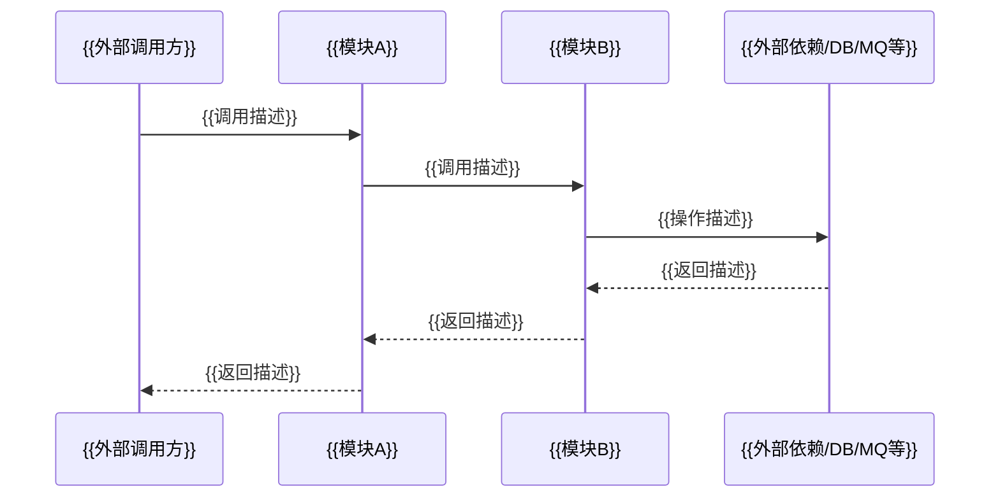

# [需求编号]模块边界设计

## Part A: 受影响模块提取 + 架构交叉验证

> 第一轮从功能设计提取，第二轮对照 software_architecture.md 交叉验证补全。

| 模块名称 | 本需求承担功能 | 是否新增 | 来源 |
|---------|---------------|---------|------|
| {{模块A}} | {{功能描述}} | {{否}} | {{AR-clarify提取}} |
| {{模块B}} | {{功能描述}} | {{否}} | {{AR-clarify提取}} |
| {{模块C}} | {{功能描述}} | {{否}} | {{架构验证补全}} |
| {{模块D}} | {{功能描述}} | {{是}} | {{AR-clarify提取}} |

**要求：**
- 模块名称必须与 software_architecture.md 中模块定义一致
- "来源"列标注：`AR-clarify提取`（优先使用）、`SR-design提取`（无AR-clarify时）、`架构验证补全`
- 架构验证补全的模块需在功能描述中说明为什么被 SR-design 遗漏
- 第二轮验证完成后，在表下方注明验证结论

<!-- 验证结论：已对照 software_architecture.md 完成交叉验证，无遗漏。 -->

## Part B: 模块边界定义

> 逐模块定义三个维度的边界：职责、上游依赖、下游暴露。

### B.1 {{模块A}}

| 维度 | 内容 |
|------|------|
| **职责** | {{本需求中该模块承担的具体职责：接收什么输入、做什么处理、产出什么结果}} |
| **上游依赖** | {{本模块依赖的其他模块/外部服务/中间件及其接口：例如 模块B.rest.GetUser、MySQL.table_xxx、Redis.cache_key_xxx}} |
| **下游暴露** | {{本模块向其他模块暴露的接口/能力：例如 REST POST /api/xxx、MQ Topic xxx、被模块C调用的方法签名}} |

### B.2 {{模块B}}

| 维度 | 内容 |
|------|------|
| **职责** | {{本需求中该模块承担的具体职责}} |
| **上游依赖** | {{本模块依赖的其他模块/外部服务/中间件及其接口}} |
| **下游暴露** | {{本模块向其他模块暴露的接口/能力}} |

### B.3 {{模块C}}（新增）

| 维度 | 内容 |
|------|------|
| **职责** | {{本需求中该模块承担的具体职责。为什么需要新增模块？已有模块为什么无法覆盖？}} |
| **上游依赖** | {{本模块依赖的其他模块/外部服务/中间件及其接口}} |
| **下游暴露** | {{本模块向其他模块暴露的接口/能力}} |

## Part C: 配置变更清单

> 只列出实际需要变更的配置，不遍历全局配置目录穷举。
> **修改内容必须指明变更点的具体位置**，描述格式：`变更位置 → 变更内容`，禁止模糊描述（如"修改数据库配置"）。

| 配置文件目录名 | 修改内容 | 是否新增 |
|-------------|---------|---------|
| {{DirectoryA}} | {{变更位置 → 变更内容，例如：user.xml 中 queryUserInfo → 新增 status 过滤条件}} | {{否}} |
| {{DirectoryB}} | {{变更位置 → 变更内容，例如：application.yml 中 spring.datasource.url → 从 dev 改为 prod 地址}} | {{是}} |

## Part D: 模块交互时序

> 将功能设计中的业务流程，翻译为模块间的调用时序。

**要求：**
- 按调用时序从左到右排列参与方
- 必须体现外部依赖（数据库、外部服务、消息队列等）
- 必须体现对外接口
- 覆盖 Part A 中所有受影响模块
- 与 Part B 的边界定义一致
- 如果与 software_architecture.md 中现有依赖关系不一致，在描述中标注 `**[与现有不一致]**`
